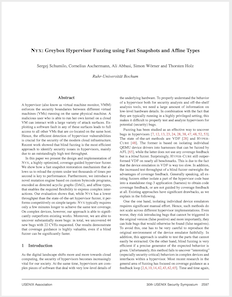

# Nyx: Greybox Hypervisor Fuzzing using Fast Snapshots and Affine Types

<a href="https://www.usenix.org/system/files/sec21-schumilo.pdf">  </a>

Nyx is fast full-VM snapshot fuzzer for type-2 hypervisors. It's built upon [kAFL](https://github.com/RUB-SysSec/kAFL), [Redqueen](https://github.com/RUB-SysSec/redqueen) and [Hyper-Cube](https://github.com/RUB-SysSec/hypercube). The fuzzer is based on our [paper](https://www.usenix.org/system/files/sec21-schumilo.pdf) ([slides](https://www.usenix.org/system/files/sec21_slides_schumilo.pdf), [recording](https://www.usenix.org/conference/usenixsecurity21/presentation/schumilo)): 

```
@inproceedings {nyx,
author = {Sergej Schumilo and Cornelius Aschermann and Ali Abbasi and Simon W{\"o}r-ner and Thorsten Holz},
title = {Nyx: Greybox Hypervisor Fuzzing using Fast Snapshots and Affine Types},
booktitle = {30th {USENIX} Security Symposium ({USENIX} Security 21)},
year = {2021},
url = {https://www.usenix.org/conference/usenixsecurity21/presentation/schumilo},
}
```

## Please note:

This release is based on our academic prototype implementation from early 2020 and it is quite outdated and has several known bugs, specific limitations and gets unstable in specific use cases (e.g. this version does not use the more stabile [libxdc](https://github.com/nyx-fuzz/libxdc) Intel-PT decoder). 

If you are interested in using Nyx or one of Nyx's components for bug hunting or to build your project upon, we are recommending to use [Nyx++](https://nyx-fuzz.com) instead. Nyx++ is a mainted, improved version of Nyx with all of its latest and greatest features. Other than that, we are not planning to maintain this prototype implementation anymore. So please do yourself a favor and use Nyx++ instead.

## Setup:

#### Install dependencies:

The following commands will install all required dependencies (assuming an Ubuntu 20.04):

```
sudo apt-get install gcc-8 libisoburn1 libgcc-8-dev-i386-cross libx32gcc-8-dev-i386-cross build-essential curl qemu-utils python3-pip python-is-python3
pip install msgpack
sudo apt-get remove libcapstone3

# install rust
curl --proto '=https' --tlsv1.2 -sSf https://sh.rustup.rs | sh

# install capstone-v4
git clone https://github.com/aquynh/capstone.git && \
cd capstone && \
git checkout v4 && \
make && \
sudo make install && \
cd -

# install all QEMU build dependencies (requires deb-src URIs in your /etc/apt/sources.list file)
sudo apt-get build-dep qemu
```

#### KVM-PT

One of Nyx's main components is KVM-PT. This standalone LKM is based on KVM (Kernel 4.20-rc4), but implements multiple features on top of KVM required to build a fast coverage-guided ring -1 fuzzer. KVM-PT provides an Intel-PT tracing module for vCPUs (instead of Intel-PT tracing per logical CPU), nested hypercalls (which are fully transparent to L1), an in-kernel dirty-memory tracker and many more other hacks.

1. Install the following kernel and reboot your system. Ensure that you are using the right kernel by using `uname`: 

   ```
   cd /tmp/ && \
   wget -c https://kernel.ubuntu.com/~kernel-ppa/mainline/v4.19/linux-headers-4.19.0-041900_4.19.0-041900.201810221809_all.deb && \
   wget -c https://kernel.ubuntu.com/~kernel-ppa/mainline/v4.19/linux-headers-4.19.0-041900-generic_4.19.0-041900.201810221809_amd64.deb && \
   wget -c https://kernel.ubuntu.com/~kernel-ppa/mainline/v4.19/linux-image-unsigned-4.19.0-041900-generic_4.19.0-041900.201810221809_amd64.deb && \
   wget -c https://kernel.ubuntu.com/~kernel-ppa/mainline/v4.19/linux-modules-4.19.0-041900-generic_4.19.0-041900.201810221809_amd64.deb && \
   sudo dpkg -i *.deb && \
   sudo reboot
   
   ```

2. After the system reboot verify that your system is using kernel 4.19 (by using `uname -a`). Otherwise, you can manually set kernel 4.19 in your grub configuration by adding the following line to `/etc/default/grub` and by generating a new GRUB config via `update-grub`:

```
GRUB_DEFAULT="Advanced options for Ubuntu>Ubuntu, with Linux 4.19.0-041900-generic"
```

2. Execute `load.sh` in `KVM-PT/` to compile and load KVM-PT.
3. Check if the `/dev/kvm-pt` device node has been created. 

### QEMU-PT:

QEMU-PT is the user-space counterpart of KVM-PT. It is based on QEMU 4.2.50 and implements userspace handlers for hypercalls, fast snapshots and a custom Intel-PT decoder. 

1. Run `sh compile_qemu_pt.h` in `QEMU-PT/` to build QEMU-PT. 
`
### Build GRUB:

1. Move to `nyx_fuzzer/hypertrash_spec/build/hypertrash_os/grub/` and unpack `grub.zip` (`unzip grub.zip`). In case you want to compile GRUB by yourself instead of using our precompiled binaries, you can use `install.sh` to do so (`gcc-6` is required).
 
### Nyx-Fuzzer: 

1. Move to `nyx_fuzzer/rust_fuzzer` and run `cargo build --release` to build the fuzzer.

## Getting Started:

### bhyve (AHCI) Fuzzing:

1. Move to the `Targets/bhyve/VM` folder.
2. Execute `prepare.sh`. This script will download an ISO image of FreeBSD 11-3, prepare a virtual disk and spawn a QEMU instance. Connect via VNC (localhost:5900) and install FreeBSD. Install the following packages: `base-dbg, kernel-dbg, ib32, ports`. Create the follwing users: ` root / password: root, user / password: user`and add user to `wheel`group. 
3. Once the OS installation has finished, reboot the VM and execute `copy_files.sh`on the host (in another shell). Connect via SSH (localhost:2222) and run install.sh as `root`. Once the script has finished and the OS has shutdown, you can terminate QEMU via CTRL+c. 
4. Run `create_pre_snapshot.sh` and connect via VNC. Login as `root`and run `/home/user/loader`. QEMU will create a pre-snapshot image and terminate. 
5. Create a config file by executing `cp Targets/bhyve/config_template.ron Targets/bhyve/config.ron` and adjust all paths in `Targets/bhyve/config.ron` (use absolute paths). 
6. Run `make_sharedir.sh` in `nyx_fuzzer/hypertrash_spec/`.
7. Move to `nyx-fuzzer/rust_fuzzer` and execute `cargo run --release -- -c ../../Targets/bhyve/config.ron` to start the fuzzer. 
8. Use the following command to show all findings: `cat /tmp/workdir_bhyve/corpus/crash/*.log | sort | uniq -c`

### qemu (legacy XHCI) Fuzzing:

1. Move to the `Targets/qemu/VM` folder.
2. Execute `prepare.sh`. This script will download an ISO image of Ubuntu 18-04 LTS, prepare a virtual disk and spawn a QEMU instance. Connect via VNC (localhost:5900) and install Ubuntu. Create the following users: `user: user / password: user`and add install `openssh-server`. 
3. Once the OS installation has finished, reboot the VM and execute `copy_install_files.sh`on the host (in another shell). Connect via SSH (localhost:2223) and run `./install.sh` as `root`. Once the install script is done and the OS has shutdown, you can terminate QEMU via CTRL+c. 
4. Run `create_pre_snapshot.sh` and connect via VNC. Login as `root`and run `/home/user/loader`. QEMU will create a pre-snapshot image and exit. 
5. Create a config file by executing `cp Targets/qemu/config_template.ron Targets/qemu/config.ron` and adjust all paths in `Targets/qemu/config.ron` (use absolute paths). 
6. Run `make_sharedir.sh` in `nyx_fuzzer/hypertrash_spec/`.
7. Move to `Targets/qemu/agent` and run `build_sharedir.sh`.
8. Move to `nyx-fuzzer/rust_fuzzer` and execute `cargo run --release -- -c ../../Targets/qemu/config.ron` to start the fuzzer. 
9. Use the following command to show all findings: `cat /tmp/workdir_qemu/corpus/crash/*.log | sort | uniq -c`


### License

Nyx is provided under **GPLv2 license**. 

**Free Software Hell Yeah!** 

Proudly provided by: 
* [Sergej Schumilo](http://schumilo.de) - sergej@schumilo.de / [@ms_s3c](https://twitter.com/ms_s3c)
* [Cornelius Aschermann](https://hexgolems.com) - cornelius@hexgolems.com / [@is_eqv](https://twitter.com/is_eqv)

